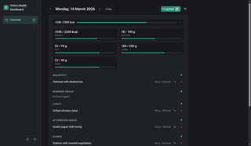
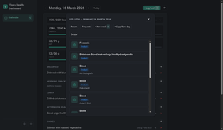
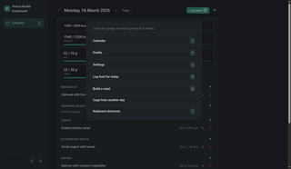
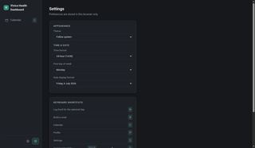
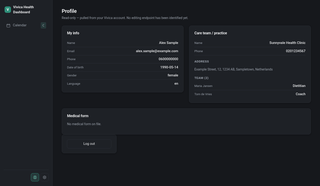
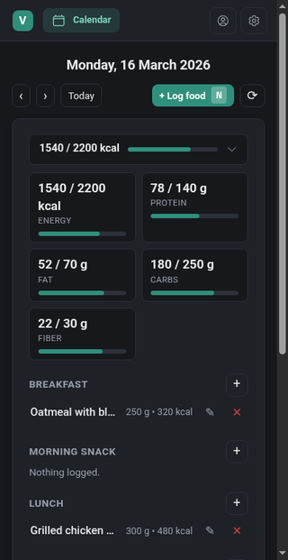

# Vivica Dashboard

<p>
  <a href="screenshots/calendar-day.png"></a>
  <a href="screenshots/log-food-modal.png"></a>
  <a href="screenshots/command-palette.png"></a>
  <a href="screenshots/settings.png"></a>
  <a href="screenshots/profile.png"></a>
  <a href="screenshots/mobile.png"></a>
</p>

<sub>Click any thumbnail for the full-size screenshot. (GitHub's Markdown renderer strips
`<script>` tags, so a real click-through carousel isn't possible here — this is a
static, clickable gallery instead. All data in these screenshots is fake demo data,
not a real account.)</sub>

A self-hosted web dashboard for logging food with [Vivica Health](https://vivica.health), so you don't have to use the Android app.

It's a small Node.js server that talks to the same API the mobile app uses (`api.vivica.health`), plus a plain HTML/JS frontend.

## Features

- **Day-focused food log** — the calendar isn't always-on-screen anymore; today's (or
  whatever day you're looking at) food log is the main view, full width. The date is
  a button — click it to open a small popover calendar (positioned right under where
  you clicked, not centered) to jump to another day; `‹`/`›` step one day at a time.
- **Nutrient totals, collapsible** — Energy/Protein/Fat/Carbs/Fiber progress bars are
  hidden by default so the log itself is the first thing you see, with a one-line
  Energy summary bar always visible to toggle them open. Your choice is remembered.
- **Log food** — search the product database, or pick from Recent/Frequent, with
  keyboard arrow-key navigation through results. Log-food day-part defaults to
  whatever makes sense for the current time of day.
- **Edit or delete logged entries** — a pencil icon next to any logged item reopens
  it pre-filled with its actual amount/serving/time so you can correct it, not just
  delete-and-redo.
- **Build a meal** — combine products into a reusable meal (syncs back to the app),
  right from the log-food modal, then log it immediately.
- **Copy entries from another day** — pick a source date, check off which items to
  bring over (e.g. repeat yesterday's breakfast), copy them into the current day.
- **Command palette** (`Ctrl`/`Cmd`+`K`) — jump to any page or straight into a
  product/meal search from anywhere.
- **Profile** — read-only view of your account info, care team/practice, and medical
  form, pulled from the same API the app uses.
- **Settings** — theme (light/dark/system), 12h/24h time, first day of week, date
  display format. All stored locally in your browser.
- Mobile-friendly responsive layout.

There's no build step and no external dependencies — just Node's built-in `http` server, `fetch`, and `node:sqlite` for local caching.

See [todo.md](./todo.md) for what's planned/in progress.

## Keyboard shortcuts

| Key | Action |
| --- | --- |
| `N` / `L` | Log food for the currently-viewed day |
| `B` | Build a meal |
| `C` | Calendar (today's log) |
| `P` | Profile |
| `S` | Settings |
| `Ctrl`/`Cmd` + `K` | Command palette |
| `/` | Focus the visible search box |
| `↑` / `↓` | Move through search results |
| `Enter` | Select the highlighted result |
| `Esc` | Close the current modal/popover, or cancel |
| `?` | Show this list |

(Also in-app under Settings → Keyboard shortcuts, or press `?` anytime.)

## Requirements

- Node.js **22.5+** (needs the built-in `node:sqlite` module)
- A Vivica account (same email/password you use in the app)

## Getting started

```bash
git clone <this repo>
cd vivica-health-dashboard
npm start
```

Then open `http://localhost:4173` and sign in with your Vivica account credentials (2FA is supported if your account has it enabled).

The port can be changed with the `PORT` environment variable:

```bash
PORT=8080 npm start
```

## How it works

- The server proxies requests to the real Vivica API and keeps your session token server-side in `data/session.json` — it never touches your device or Google account, and credentials aren't stored anywhere except that local session file.
- Search results and other slow-changing data (product lookups, item details, supermarket types) are cached locally in a SQLite database at `data/vivica.db`, so the dashboard feels fast and doesn't hammer the upstream API.
- The `data/` directory is gitignored — it's local state, not something you commit.

### Single session only

The server holds **one** Vivica session at a time (one access token in
`data/session.json`) — there's no per-browser login, no user accounts, and no
concept of multiple people using the same running server as themselves. If you
log in as a different account, it replaces the previous session. Run one instance
per Vivica account (see [todo.md](./todo.md) for plans to support multiple
concurrent sessions).

### Vivica API

See [API_REFERENCE.md](./API_REFERENCE.md)

## Self-hosting

This is meant to run wherever you'd run any small Node app: a home server, a Raspberry Pi, a VPS, etc. Since it holds a live session token for your Vivica account, treat `data/session.json` like a credential and don't expose the server to the open internet without authentication in front of it (a reverse proxy with basic auth, a VPN/Tailscale, etc.).

## Disclaimer

This is an unofficial, independent project and isn't affiliated with or endorsed by Vivica Health. It works by calling the same API the official app uses, which could change at any time and break this dashboard.
