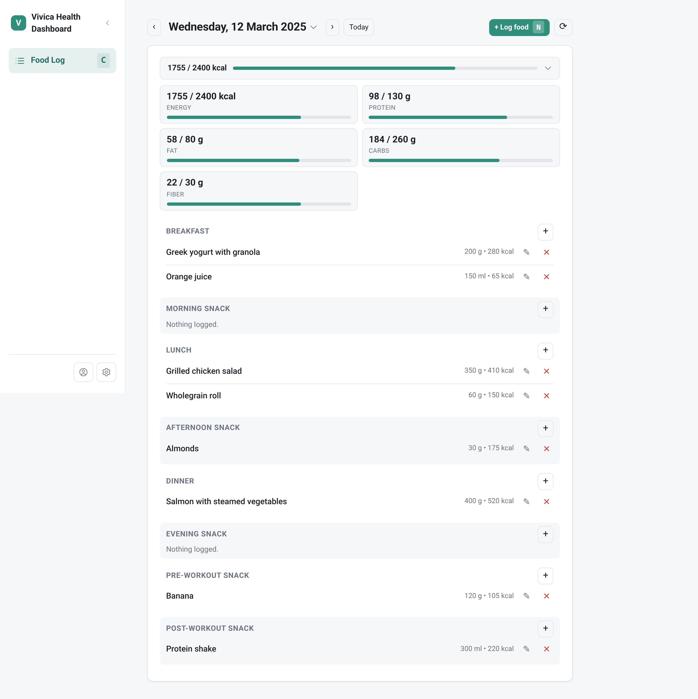

# Vivica Dashboard

<p>
  
</p>

A self-hosted web dashboard for logging food with [Vivica Health](https://vivica.health), so you don't have to use the Android app.

It's a small Node.js server that talks to the same API the mobile app uses (`api.vivica.health`), plus a plain HTML/JS frontend.

## Features

- **Day view** — a single day's food log, full width. Click the date to pick another
  day from a small calendar popover, or use `‹`/`›` to step a day at a time.
- **Collapsible nutrient totals** — Energy/Protein/Fat/Carbs/Fiber progress bars,
  tucked behind a one-line Energy summary.
- **Log food** — search the product database, or pick from Recent/Frequent, with
  keyboard navigation through results. Defaults the meal/day-part to whatever fits
  the current time of day.
- **Edit or delete logged entries** — correct an entry's amount, serving, or time
  without deleting and re-logging it.
- **Build a meal** — combine products into a reusable meal that syncs back to the app.
- **Copy entries from another day** — pick a day, choose which items to bring over.
- **Command palette** (`Ctrl`/`Cmd`+`K`) — jump to any page or straight into a
  product/meal search.
- **Scan a barcode** — use your webcam (desktop) or phone camera (mobile) to scan a
  product's barcode instead of typing/searching. Requires HTTPS — see
  [Barcode scanning](#barcode-scanning) below.
- **Profile** — read-only account info, care team/practice, and medical form.
- **Settings** — theme, time format, first day of week, date display format.
- Mobile-friendly.

There's no build step and no external dependencies — just Node's built-in `http` server, `fetch`, and `node:sqlite` for local caching.

See [todo.md](./todo.md) for what's planned/in progress.

## Keyboard shortcuts

| Key | Action |
| --- | --- |
| `N` / `L` | Log food for the currently-viewed day |
| `B` | Build a meal |
| `C` | Food Log |
| `P` | Profile |
| `S` | Settings |
| `Ctrl`/`Cmd` + `K` | Command palette |
| `/` | Focus the visible search box |
| `↑` / `↓` | Move through search results |
| `Enter` | Select the highlighted result |
| `Esc` | Close the current modal/popover, or cancel |
| `?` | Show this list |

(Also in-app under Settings → Keyboard shortcuts, or press `?` anytime.)

## Requirements

- Node.js **22.5+** (needs the built-in `node:sqlite` module)
- A Vivica account (same email/password you use in the app)

## Getting started

```bash
git clone <this repo>
cd vivica-health-dashboard
npm start
```

Then open `http://localhost:4173` and sign in with your Vivica account credentials (2FA is supported if your account has it enabled).

The port can be changed with the `PORT` environment variable:

```bash
PORT=8080 npm start
```

By default the server binds `127.0.0.1` and is only reachable from the machine
it runs on. Anyone who can reach the port acts as the logged-in user (there is
no per-client auth), so widening is opt-in:

```bash
# Listen on all interfaces, reachable from the LAN.
HOST=0.0.0.0 npm start
```

### Docker

No image to build or pull — since there's no build step, `docker-compose.yml`
just runs the plain `node:22-alpine` image against the repo, bind-mounted in
directly:

```bash
git clone <this repo>
cd vivica-health-dashboard
docker compose up -d
```

Then open `http://localhost:4173` and sign in. `data/` (session + SQLite
cache) is part of the same bind mount, so it lives in the repo directory and
survives container restarts.

To change the port, edit the `ports:` mapping in `docker-compose.yml` (the
container always listens on `4173` internally — map it to whatever host port
you want, e.g. `"127.0.0.1:8080:4173"`).

The mapping in `docker-compose.yml` exposes `4173` on all interfaces by
default, so the dashboard is reachable from other devices on the network.

## How it works

- The server proxies requests to the real Vivica API and keeps your session token server-side in `data/session.json` — it never touches your device or Google account, and credentials aren't stored anywhere except that local session file.
- Search results and other slow-changing data (product lookups, item details, supermarket types) are cached locally in a SQLite database at `data/vivica.db`, so the dashboard feels fast and doesn't hammer the upstream API.
- The `data/` directory is gitignored — it's local state, not something you commit.

### Single session only

The server holds one Vivica session at a time. Logging in as a different account
replaces it — run one instance per Vivica account (see [todo.md](./todo.md) for
plans to support multiple concurrent sessions).

### Vivica API

See [API_REFERENCE.md](./API_REFERENCE.md)

## Barcode scanning

Camera access (`getUserMedia`) only works in a [secure context](https://developer.mozilla.org/en-US/docs/Web/Security/Secure_Contexts) — browsers block it entirely on plain `http://`. This is transparent on `http://localhost`, which browsers exempt, but scanning **will not work** if you access the dashboard over `http://` from another device (e.g. your phone, via its LAN IP).

To use barcode scanning from your phone, put the dashboard behind HTTPS — a reverse proxy (Caddy, nginx, Traefik, etc.) terminating TLS in front of it, a self-signed cert you trust on the phone (e.g. via `mkcert`), or a tunnel (Tailscale Funnel, Cloudflare Tunnel, ngrok). If the camera prompt never appears or scanning silently fails on mobile, this is almost always why.

## Self-hosting

This is meant to run wherever you'd run any small Node app: a home server, a Raspberry Pi, a VPS, etc., either directly with Node or via [Docker](#docker). Since it holds a live session token for your Vivica account, treat `data/session.json` like a credential and don't expose the server to the open internet without authentication in front of it (a reverse proxy with basic auth, a VPN/Tailscale, etc.).

## Disclaimer

This is an unofficial, independent project and isn't affiliated with or endorsed by Vivica Health. It works by calling the same API the official app uses, which could change at any time and break this dashboard.
